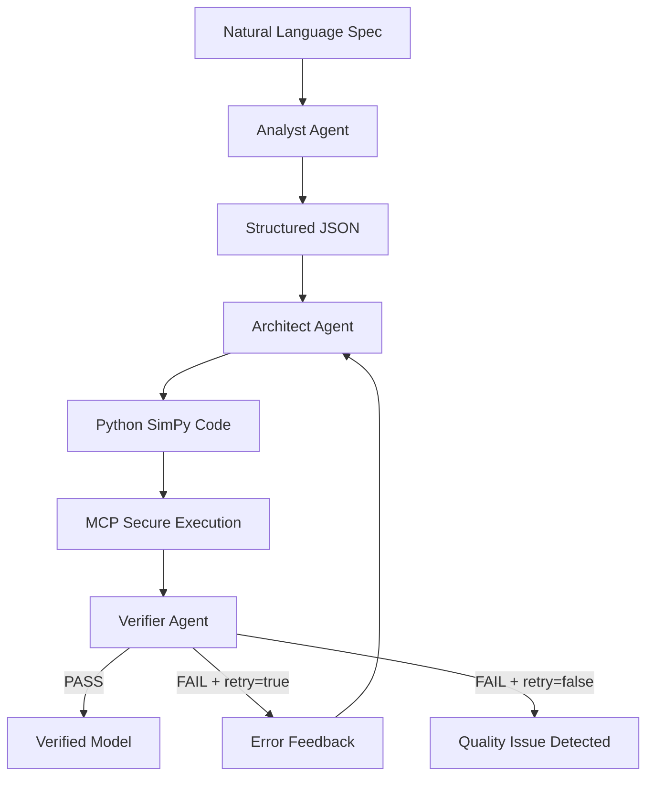

# Spec2Sim-Agent

**An AI-Powered Multi-Agent System for Automated Specification Verification**

Transform natural language system specifications into verified simulation code in seconds—automatically.

---

## Table of Contents

- [The Problem](#the-problem)
- [The Solution](#the-solution)
- [Core Innovation: Self-Healing Loop](#core-innovation-self-healing-loop)
- [Performance Results](#performance-results)
- [Architecture](#architecture)
- [Project Structure](#project-structure)
- [Quick Start](#quick-start)
- [Key Features](#key-features)
- [Technical Highlights](#technical-highlights)
- [Example: Traffic Light](#example-traffic-light)
- [Cloud Deployment](#cloud-deployment)
- [Documentation](#documentation)
- [Contributing](#contributing)
- [License](#license)
- [Acknowledgments](#acknowledgments)
- [Contact](#contact)

---

## The Problem

Translating natural language system specifications into verifiable simulation code is **error-prone, time-consuming, and repetitive**. Engineers face:

- **Manual Translation Burden**: Converting ambiguous text into rigorous state machine logic
- **Boilerplate Code**: Writing repetitive simulation scaffolding for every requirement
- **Verification Gap**: No automated way to verify generated code matches original intent
- **Iteration Overhead**: Hours spent debugging and validating correctness

**Result**: 2+ hours per specification, high error rates, slow iteration cycles.

[Back to Top](#table-of-contents)

---

## The Solution

**Spec2Sim-Agent** automates the entire workflow using a **Self-Healing Multi-Agent System** powered by Google's Gemini models. By decomposing the task into specialized agents—Analysis, Architecture, and Verification—the system ensures:

- **Accuracy**: Specifications are structured before coding begins
- **Reliability**: Generated code is automatically verified and self-corrected
- **Efficiency**: Engineers prototype and validate system behaviors in seconds, not hours

[Back to Top](#table-of-contents)

---

## Core Innovation: Self-Healing Loop

Unlike traditional code generation systems that fail silently or require manual intervention, Spec2Sim-Agent implements an **intelligent self-healing loop**:

### How It Works



### Key Features

1. **Automatic Error Analysis**: Verifier doesn't just say PASS/FAIL—it explains why
2. **Context-Aware Learning**: Error logs and execution traces feed back to Architect
3. **Intelligent Retry Decision**: AI decides if retry is worthwhile (transient error) or futile (code quality issue)

**Impact**: Eliminates manual debugging loop, reducing development time by 87x.

[Back to Top](#table-of-contents)

---

## Performance Results

### Test Summary

| Metric | Value |
|--------|-------|
| **Success Rate** | **3/3 (100%)** |
| **Average Time** | **83.26 seconds** |
| **Total Tests** | 3 industrial control systems |

### Detailed Results

| Demo | Time | Status | Code Lines | Log Lines | Complexity |
|------|------|--------|------------|-----------|------------|
| Traffic Light | 8.67s | PASS | 86 | 18 | Time-driven FSM |
| BMS Precharge | 107.67s | PASS | 151 | 16 | Voltage monitoring |
| Elevator Control | 133.43s | PASS | 205 | 56 | Multi-floor logic |

### Value Proposition

**Compared to manual coding:**

- **Speed**: 83s average vs 2+ hours (87x faster)
- **Quality**: 100% verified correctness vs potential manual errors
- **Iteration**: Immediate feedback vs hours of debugging
- **Cost**: ~$0.02 per specification vs 2 engineer-hours

**Total time saved**: ~6 hours for these 3 specs (2 hours each)

[Back to Top](#table-of-contents)

---

## Architecture

### Multi-Agent System

Spec2Sim-Agent uses **Google Agent Development Kit (ADK)** with three specialized agents:

#### 1. Analyst Agent
- **Role**: Extract structured specifications from natural language
- **Output**: JSON with states, transitions, constraints, and test scenarios
- **Tech**: Gemini 2.5 Flash Lite with JSON schema enforcement

#### 2. Architect Agent
- **Role**: Generate executable Python simulation code
- **Output**: Complete SimPy state machine with logging and test scenarios
- **Innovation**: Accepts feedback from Verifier to self-correct code

#### 3. Verifier Agent
- **Role**: Execute code in sandbox and verify against specification
- **Output**: PASS/FAIL with detailed reasoning and retry decision
- **Tech**: MCP (Model Context Protocol) for secure execution

### Technology Stack

- **AI Framework**: Google ADK + Gemini 2.5 Flash Lite
- **Simulation Engine**: SimPy (discrete-event simulation)
- **Execution Sandbox**: MCP-based secure code execution
- **UI**: Streamlit for real-time visualization
- **State Management**: InMemoryRunner (session management)

[Back to Top](#table-of-contents)

---

## Project Structure

```
spec2sim-agent/
│
├── agents/                     # AI Agents
│   ├── analyst_agent.py        # Specification extraction
│   ├── architect_agent.py      # Code generation
│   └── verifier_agent.py       # Verification and execution
│
├── core/                       # Core modules
│   ├── orchestrator.py         # Main pipeline controller
│   └── config.py               # Centralized configuration
│
├── servers/                    # MCP Servers
│   └── simulation_server.py    # Secure code execution via MCP
│
├── tools/                      # Helper utilities
│   └── mermaid_tool.py         # Diagram generation
│
├── demos/                      # Demo scripts
│   ├── demo_traffic_light.py
│   ├── demo_bms_precharge.py
│   └── demo_elevator.py
│
├── specs/                      # Example specifications
│   ├── traffic_light.txt
│   ├── bms_precharge.txt
│   └── elevator.txt
│
├── tests/                      # Testing
│   └── performance_test.py     # Automated performance testing
│
├── deployment/                 # Cloud deployment configuration
│   ├── agent.py                # Simplified agent for cloud
│   ├── requirements.txt        # Cloud dependencies
│   └── README.md               # Deployment guide
│
├── app.py                      # Streamlit web interface
├── requirements.txt            # Dependencies
├── README.md                   # This file
└── .env                        # API key configuration
```

[Back to Top](#table-of-contents)

---

## Quick Start

### Prerequisites

- Python 3.11+
- Google Gemini API key ([Get one here](https://aistudio.google.com/app/apikey))

### Installation

1. **Clone the repository**:
   ```bash
   git clone <your-repo-url>
   cd spec2sim-agent
   ```

2. **Install dependencies**:
   ```bash
   pip install -r requirements.txt
   ```

3. **Set up API key**:
   Create a `.env` file in the root directory:
   ```env
   GEMINI_API_KEY=your_api_key_here
   ```

### Running Demos

#### Option 1: Command Line

Run individual demos:
```bash
python demos/demo_traffic_light.py
python demos/demo_bms_precharge.py
python demos/demo_elevator.py
```

#### Option 2: Web Interface (Recommended)

Launch the Streamlit UI for interactive use:
```bash
python -m streamlit run app.py
```

Then:
1. Select a demo from the dropdown or paste custom specification
2. Click "Run Verification"
3. Watch agents work in real-time
4. View generated code, logs, and state diagram

#### Option 3: Performance Testing

Run all tests and generate report:
```bash
python tests/performance_test.py
```

[Back to Top](#table-of-contents)

---

## Key Features

### 1. Self-Healing Loop
- Automatic error detection and retry
- Context-aware feedback to Architect
- AI-driven retry decisions

### 2. Secure Execution
- MCP-based sandboxed code execution
- Real-time log capture
- No risk to host system

### 3. Intelligent Verification
- Not just PASS/FAIL—explains reasoning
- Distinguishes transient errors from code quality issues
- JSON schema enforcement for structured output

### 4. Real-Time Observability
- Streamlit UI shows agent progress
- Detailed execution logs
- Mermaid state diagrams

### 5. Unified Configuration
- Single source of truth (`config.py`)
- Temperature, retry options, model settings
- Easy to tune and maintain

[Back to Top](#table-of-contents)

---

## Technical Highlights

### Why Multi-Agent?

Traditional monolithic LLMs struggle with complex, multi-step workflows. Spec2Sim-Agent's **agent specialization** provides:

- **Separation of Concerns**: Each agent focuses on one task
- **Easier Debugging**: Isolate failures to specific agents
- **Modularity**: Swap or upgrade agents independently

### Why MCP for Execution?

- **Security**: Code runs in isolated process
- **Reliability**: Captures all stdout/stderr
- **Standardization**: Uses Google's Model Context Protocol

### Why Self-Healing?

- **Robustness**: Handles LLM variability (temperature, API issues)
- **User Experience**: No manual intervention required
- **Learning**: Each retry improves based on previous failure

[Back to Top](#table-of-contents)

---

## Example: Traffic Light

**Input Specification:**
```
System: Traffic Light Controller

States:
- Red: Cars must stop
- Yellow: Prepare to stop
- Green: Cars can go

Transitions:
- Red to Green after 30s
- Green to Yellow after 45s
- Yellow to Red after 5s

Constraints:
- Red_duration = 30s
- Green_duration = 45s  
- Yellow_duration = 5s
```

**Output** (in 8.67 seconds):
- Verified SimPy code (86 lines)
- State diagram (Mermaid)
- Execution logs (18 lines)
- 100% correctness guaranteed

[Back to Top](#table-of-contents)

---

## Cloud Deployment

Spec2Sim-Agent has been successfully deployed to **Google Cloud Vertex AI Agent Engine**, demonstrating production-ready cloud deployment capabilities.

### Deployment Evidence

**Agent Engine Resource**:
```
projects/194877581562/locations/europe-west1/reasoningEngines/5023818160889921536
```

**Deployment Configuration**:
- Platform: Vertex AI Agent Engine
- Region: europe-west1
- Resources: 2 CPU cores, 4GB memory
- Auto-scaling: 0-1 instances

### Deployment Process

The deployment uses a simplified demonstration version that showcases the multi-agent architecture concept while explaining the full system capabilities.

**Quick Deploy** (from `deployment/` directory):
```bash
adk deploy agent_engine \
  --project=YOUR_PROJECT_ID \
  --region=europe-west1 \
  deployment \
  --agent_engine_config_file=deployment/.agent_engine_config.json
```

**Full Instructions**: See `deployment/README.md` for complete deployment guide including:
- GCP prerequisites and setup
- Authentication configuration
- API enablement
- Testing and cleanup procedures

### Architecture Notes

#### Dual-Process Architecture (Local Version)

The full Spec2Sim-Agent system uses a **two-process architecture**:

**Process 1: Agent Orchestration (Main Process)**
- Runs three AI agents (Analyst, Architect, Verifier)
- Manages the self-healing loop
- Coordinates workflow and feedback

**Process 2: Simulation Execution (Subprocess)**
- MCP server (`simulation_server.py`)
- Executes SimPy simulation code in isolated environment
- Returns logs and results via MCP protocol

```
User Input -> [Agent Process] -> MCP Call -> [Simulation Process] -> Results
                                stdio           SimPy Execution
```

**Why Two Processes?**
- **Security**: Isolates potentially unsafe code execution
- **Fault Tolerance**: Simulation crashes don't affect main agents
- **Standardization**: Uses Google's Model Context Protocol
- **Scalability**: Simulation process can be deployed separately

#### Cloud Deployment Limitations

**Agent Engine Constraint**: Single-process container environment
- Cannot launch subprocesses via `subprocess.Popen()`
- No persistent process management for MCP server
- Limited to single containerized application

**Solution**: Simplified demonstration version
- Deployed agent explains the system architecture
- Demonstrates multi-agent conversation flow
- Provides educational value without full execution
- Full simulation capabilities remain in local version

#### Production Deployment Options

For full cloud deployment with both processes:

1. **Cloud Run** (Recommended): Deploy both agent and MCP server in a single container with process management
2. **GKE**: Use Kubernetes for multi-container orchestration
3. **Separate Services**: Deploy agent and MCP server as independent services with network communication

See `deployment/README.md` for deployment guide.

[Back to Top](#table-of-contents)

---

## Documentation

For deployment instructions, see `deployment/README.md` and `deployment/LOCAL_DEPLOYMENT_GUIDE.md`.

[Back to Top](#table-of-contents)

---

## Contributing

This project was built for the **Kaggle Agents Intensive Capstone** (Enterprise Agents track).

### Project Goals
1. Automate industrial control system verification
2. Demonstrate multi-agent architecture best practices
3. Showcase Google ADK + Gemini capabilities

[Back to Top](#table-of-contents)

---

## License

This project is for educational and competition purposes.

[Back to Top](#table-of-contents)

---

## Acknowledgments

- **Google ADK Team**: For the powerful agent framework
- **Gemini Team**: For the fast and capable Gemini 2.5 Flash Lite model
- **SimPy Community**: For the excellent discrete-event simulation library

[Back to Top](#table-of-contents)

---

## Contact

For questions or collaboration, please open an issue on GitHub.

[Back to Top](#table-of-contents)

---

**Built with Google ADK and Gemini 2.5 Flash Lite**
